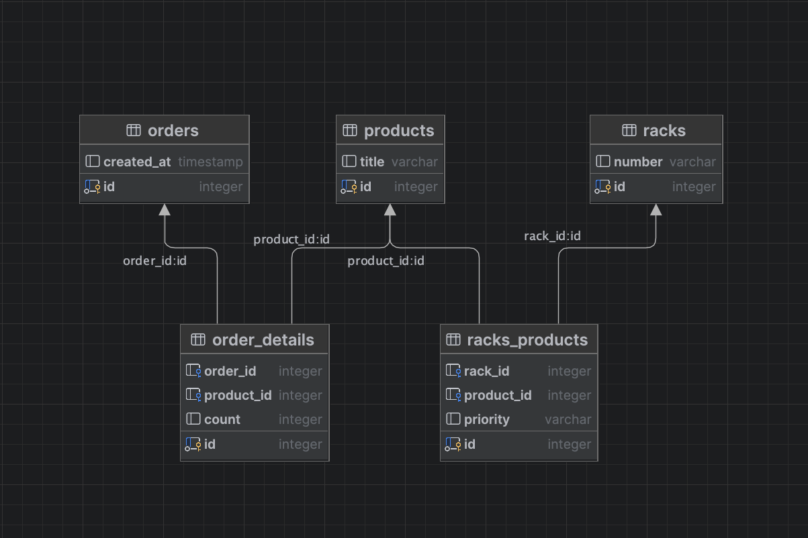
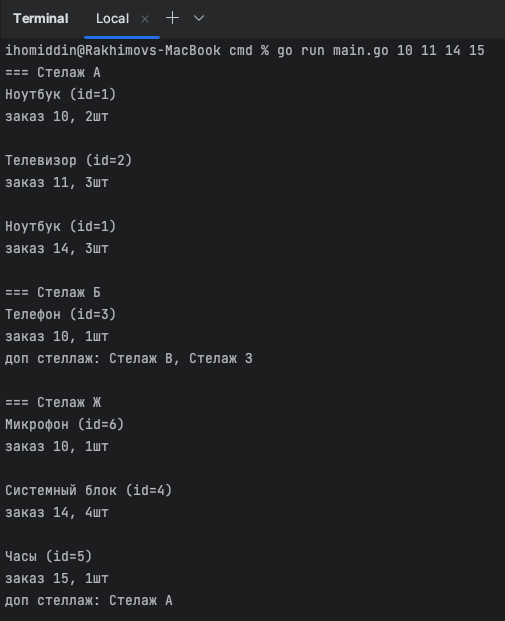

Конечно! Вот обновленный файл README.md на русском языке для вашего проекта на Golang с использованием базы данных Postgres:

# Консольное приложение для сборки заказов

Это консольное приложение, написанное на языке Golang, которое помогает собирать несколько заказов в интернет-магазине. Приложение извлекает и отображает товары, сгруппированные по основным полкам для указанных заказов.

## Содержание

- [Описание](#описание)
- [Установка](#установка)
- [Использование](#использование)
- [Схема базы данных](#схема-базы-данных)
- [Скриншоты](#скриншоты)
- [Вклад](#вклад)
- [Лицензия](#лицензия)

## Описание

Это консольное приложение разработано для оптимизации процесса сборки нескольких заказов в интернет-магазине. Оно извлекает товары из базы данных и группирует их по основным полкам, связанным с указанными заказами. Приложение обеспечивает эффективное выполнение и минимальное использование ресурсов, даже при больших объемах данных.

## Установка

1. Клонируйте репозиторий с GitHub:

```
git clone https://github.com/ваш-юзернейм/ваш-репозиторий.git
```

2. Установите необходимые зависимости.

```
go mod download
```

3. Настройте базу данных PostgreSQL и создайте необходимые таблицы. Используйте предоставленный SQL-скрипт `database.sql` для создания таблиц и вставки начальных данных.

```
psql -U ваш-юзернейм -d ваша-база-данных -f database.sql
```

## Использование

1. Обновите конфигурацию подключения к базе данных в файле `config.go`, чтобы она соответствовала учетным данным и настройкам вашей PostgreSQL базы данных.

2. Запустите консольное приложение и укажите номера заказов в качестве аргументов командной строки. Например:

```
go run main.go 10 11 14 15
```

3. Приложение извлечет товары, связанные с указанными заказами, и отобразит их, сгруппированные по основным полкам.

## Схема базы данных

Схема базы данных для этого проекта разработана с использованием PostgreSQL. Схема включает в себя следующие таблицы:

- `orders`: Хранит информацию о заказах, размещенных клиентами.
- `products`: Содержит информацию о доступных товарах в магазине.
- `shelves`: Представляет полки на складе, где хранятся товары.
- `order_products`: Сопоставляет товары с соответствующими заказами.

Для визуализации схемы базы данных, пожалуйста, обратитесь к предоставленной диаграмме:


## Скриншоты
Пример скриншота вывода в консоль для предоставленных номеров 
заказов (10, 11, 14, 15), чтобы продемонстрировать, что приложение выдает ожидаемые результаты.


## Вклад
Вклад в этот проект приветствуется. Не стесняйтесь открывать issue и отправлять pull request'ответы.

## Лицензия
[MIT License](https://opensource.org/licenses/MIT)